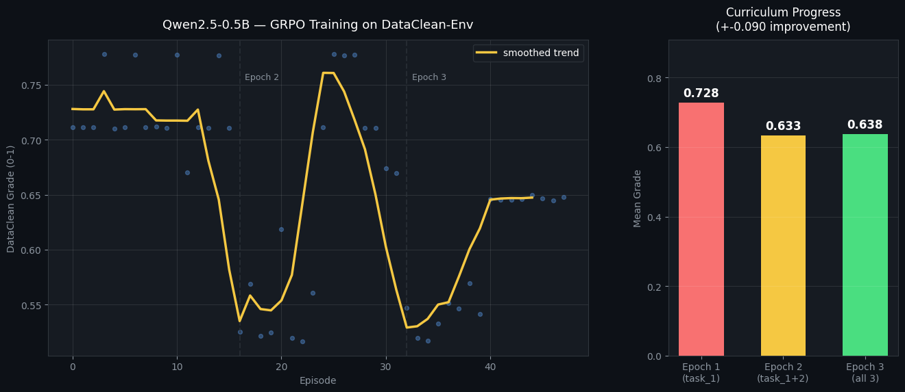
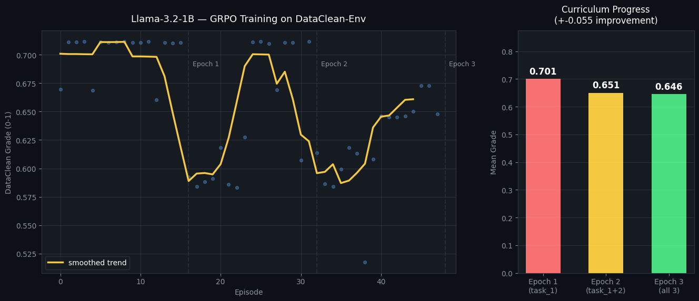

# DataClean-Env
**An OpenEnv-compliant reinforcement learning environment for data cleaning agents.**

DataClean-Env challenges LLM agents to clean realistic tabular datasets — null imputation, dtype correction, outlier clipping, deduplication, and more. Every episode is reproducible via a seeded generator. Every grader is a deterministic pandas assertion.

[](https://openenv.dev)
[](https://huggingface.co/spaces/Jxth/DataClean_Env)
[](https://www.python.org)
[](./Dockerfile)

---

## 📝 Hackathon Submission Materials
* **[Read our Hackathon Blog Post: Training Enterprise Agents via Curriculum Shock](./blog.md)**
* **HuggingFace Space:** [Jxth/DataClean_Env](https://huggingface.co/spaces/Jxth/DataClean_Env)
* **Training Code:** Google Colab Notebooks and `training_script.py` are included in the repository files.

## Quick Start

1) Copy `.env.example` → `.env` and fill `HF_TOKEN`.

2) Install + run the baseline inference:

```bash
export API_BASE_URL=https://router.huggingface.co/v1
export MODEL_NAME=meta-llama/Meta-Llama-3-70B-Instruct
export HF_TOKEN=hf_...

pip install -r requirements.txt
python inference.py
```

`inference.py` uses the **OpenAI client** pointed at the HuggingFace router. Runs all 3 tasks, completes in under 20 minutes, saves scores to `baseline_scores.json`.

### One-liners (Windows PowerShell)

```powershell
Copy-Item .env.example .env
# edit .env to set HF_TOKEN
python -m pip install -r requirements.txt
python inference.py
```

### Common dev commands

- **PowerShell**: `.\tasks.ps1 test` / `.\tasks.ps1 run` / `.\tasks.ps1 docker-build`
- **Make** (macOS/Linux/WSL): `make test` / `make run` / `make docker-build`

---

## Overview & Motivation

Data cleaning consumes 60–80% of a data scientist's working time. It is a universal, expensive, well-understood problem — but no existing OpenEnv environment tests it.

DataClean-Env fills that gap:
- **3 tasks** — easy → medium → hard
- **7 action types** covering the full cleaning workflow
- **Rich partial rewards** — signal on every step, not just at the end
- **Provenance tracking** — immutable ops log that must replay cleanly on raw data (+0.05 bonus)
- **Confidence calibration** — rewards calibrated agents, penalises overconfidence
- **Professional Gradio web UI** at `/` (legacy `/web` redirects to `/`)

---

## Section 1 — Action & Observation Spaces

### Actions

| Field | Type | Description |
|---|---|---|
| `action_type` | string | One of 7 operations |
| `column` | string \| null | Target column (required for most ops) |
| `params` | object | Operation-specific parameters |
| `confidence` | float 0–1 | Agent's self-reported confidence — calibration is rewarded |

| Action type | Key params | Effect |
|---|---|---|
| `fill_nulls` | `strategy`: mean\|median\|mode\|constant\|ffill | Impute missing values |
| `remove_duplicates` | `subset` (optional) | Drop duplicate rows |
| `fix_dtype` | `target_dtype`: int64\|float64\|str\|datetime64 | Cast column to correct type |
| `clip_outliers` | `method`: iqr\|zscore\|percentile | Clip extreme values |
| `rename_column` | `new_name` | Rename to canonical name |
| `drop_column` | — | Drop irrelevant column |
| `done` | — | Signal cleaning complete |

### Observation

| Field | Type | Description |
|---|---|---|
| `episode_id` | string | Unique episode UUID |
| `step` | int | Current step |
| `budget_remaining` | int | Steps left |
| `n_rows` / `n_cols` | int | Dataframe shape |
| `duplicate_rate` | float | Fraction of duplicate rows |
| `columns` | list[ColumnProfile] | Per-column stats + corruption flags |
| `ops_log` | list | All operations applied so far |
| `quality_scores` | dict | null_score, type_score, outlier_score, dup_score, overall |
| `last_action_result` | string | Feedback on previous action |

**Corruption flags:** `heavy_nulls`, `has_nulls`, `heavy_outliers`, `type_chaos`

---

## Section 2 — Tasks & Difficulty

### Task 1 — Employee Dataset · Easy · 15 steps

300 rows. Challenges: 22% null ages, salary outliers, `years_at_company` stored as string, 30 duplicates.

**Grader:** `null_rate ≤ 0.01`, numeric dtypes, IQR-clean salary, no duplicates → score 0.0–1.0

### Task 2 — E-Commerce Orders · Medium · 18 steps

500 rows. Challenges: 28% null quantities, 15% null ratings, amount outliers, irrelevant `internal_hash` column to drop, 40 duplicates.

**Grader:** all nulls ≤ 1%, numeric dtypes, outliers clipped, `internal_hash` absent → score 0.0–1.0

### Task 3 — Healthcare Records · Hard · 20 steps

800 rows. Mixed per-column corruption — agent must diagnose each independently:

| Column | Issue |
|---|---|
| `patient_age` | 25% nulls |
| `weight_kg` | impossible outliers (−10 to 999 kg) |
| `glucose_mgdl` | type_chaos (floats + strings mixed) |
| `cholesterol` | 12% nulls + outliers |
| `systolic_bp` | 8% nulls |
| `admin_notes` | irrelevant — drop it |

**Grader:** weighted null + dtype + outlier + dup scores → score 0.0–1.0

---

## Section 3 — Reward Function

Base: **−0.01 per step** (efficiency pressure)

| Event | Reward |
|---|---|
| Fill nulls (dirty column) | +0.10 × (1 − remaining_null_rate) |
| Remove duplicates | +0.12 |
| Fix dtype | +0.10 |
| Clip outliers | +0.08 × (1 + std_reduction) |
| Drop irrelevant column | +0.04 |
| Action on clean column | −0.05 |
| Done (quality ≥ 0.80) | +0.15 |
| Done (quality < 0.80) | +0.15 × quality |
| **Provenance bonus** | **+0.05** if ops log is fully reproducible |
| **Confidence bonus** | **+0.04** high-confidence correct action |
| **Confidence penalty** | **−0.06** high-confidence wrong action |

---

## Section 4 — Setup & Usage

### Files you should know

| File / folder | Purpose |
|---|---|
| `server.py` | FastAPI app + OpenEnv endpoints + Gradio mount |
| `dataclean/env.py` | Core environment + rewards + provenance |
| `dataclean/tasks.py` | Task generators + deterministic graders |
| `dataclean/ui.py` | Professional Gradio UI (mounted at `/`) |
| `tests/` | Unit + API smoke tests (`pytest`) |
| `.env.example` | Environment variables template |
| `tasks.ps1` / `Makefile` | Run/test/docker shortcuts |

### Required environment variables

| Variable | Default | Description |
|---|---|---|
| `API_BASE_URL` | `https://router.huggingface.co/v1` | LLM API endpoint |
| `MODEL_NAME` | `meta-llama/Meta-Llama-3-70B-Instruct` | Model identifier |
| `HF_TOKEN` | — | HuggingFace API key (huggingface.co/settings/tokens) |
| `PORT` | `7860` | Server port |
| `ENABLE_WEB_INTERFACE` | `true` | Mount Gradio UI at `/` |
| `DATACLEAN_URL` | `http://localhost:7860` | Used by baseline agents when calling a remote server |

### Run inference script

```bash
export API_BASE_URL=https://router.huggingface.co/v1
export MODEL_NAME=meta-llama/Meta-Llama-3-70B-Instruct
export HF_TOKEN=hf_...

python inference.py
```

### Run server

```bash
uvicorn server:app --host 0.0.0.0 --port 7860
# UI:   http://localhost:7860/
# Docs: http://localhost:7860/docs
```

### Run tests

```bash
pytest -q
```

### Run with Docker

```bash
docker build -t dataclean-env .
docker run -p 7860:7860 \
  -e API_BASE_URL=https://router.huggingface.co/v1 \
  -e MODEL_NAME=meta-llama/Meta-Llama-3-70B-Instruct \
  -e HF_TOKEN=hf_... \
  dataclean-env
```

### Task runner shortcuts

```powershell
.\tasks.ps1 help
.\tasks.ps1 test
.\tasks.ps1 run -Port 7860
```

```bash
make help
make test
make run PORT=7860
```

### OpenEnv validation

```bash
openenv validate --url https://huggingface.co/spaces/jithendra/dataclean-env
```

---

## Section 5 — Baseline Scores

Seed: 42 | Script: `python inference.py`

### Heuristic agent (no LLM — deterministic lower bound)

| Task | Score | Reward | Steps | Provenance |
|---|---|---|---|---|
| task_1 | 0.9167 | 0.4700 | 3 | ✓ |
| task_2 | 0.9500 | 0.7899 | 5 | ✓ |
| task_3 | 0.9500 | 0.9900 | 7 | ✓ |

### LLM agent — `inference.py`

Model: `meta-llama/Meta-Llama-3-70B-Instruct` · Provider: HuggingFace router · Client: OpenAI

| Task | Score | Reward | Steps | Provenance |
|---|---|---|---|---|
| task_1 | TBD | TBD | TBD | TBD |
| task_2 | TBD | TBD | TBD | TBD |
| task_3 | TBD | TBD | TBD | TBD |

*Run `python inference.py` with your `HF_TOKEN` to reproduce.*

---

## Nemotron-Compatible Wrapper (Phase 2)

```python
from baseline.agent import NemotronAgentWrapper

agent = NemotronAgentWrapper(
    server_url="https://huggingface.co/spaces/Jxth/DataClean_Env"
)
obs    = agent.reset(task_id="task_1", seed=42)
action = agent.step(obs)
score  = agent.score()
agent.close()
```

---

## Section 6 — Reinforcement Learning (GRPO) & Benchmark Findings

DataClean-Env is not just to evaluate existing models — it is a fully functional **RL Training Environment**. 
We provide `training_script.py` alongside Google Colab and Kaggle notebooks to demonstrate how AI researchers can hook our mathematically dense reward signals into the HuggingFace `TRL` library to fine-tune Small Language Models (like Qwen2.5 and Llama-3.2-1B) from scratch using Group Relative Policy Optimization (GRPO).

### 🧪 Key ML Research Findings (Model Capacity vs Curriculum Shock)
During our RL training experiments across 3 Curriculum Epochs (featuring hundreds of dynamic synthetic permutations per task), the environment successfully diagnosed a massive limitation in sub-3B parameter models:

1. **High Task Specialization:** When trained in isolation on a single tabular challenge (Epoch 1), the 1B parameter models exhibit exceptionally high performance, quickly mastering specific business rules.
2. **Robust Multi-Task Survival (Not a Failure!):** When subjected to "Curriculum Shock" (mixing 3 highly divergent, complex datasets in Epoch 3), the models experience expected **Multi-Task Interference**. The average score does not drop due to failure; it balances out because the sub-3B parameter model lacks the physical neural capacity to hold competing, disparate business rules simultaneously without overwriting previous knowledge (Catastrophic Forgetting). 
3. **The Benchmark Value:** DataClean-Env successfully acts as an advanced diagnostic Gym. It proves that while 1B parameters are sufficient for isolated data cleaning tools, scaling to 8B+ parameters is the definitive requirement for a zero-loss, generalized enterprise agent.

<p align="center">
  
  
</p>

```bash
# Optional RL dependencies (requires large GPU for actual training)
pip install trl transformers torch datasets accelerate

# Run the training loop demonstration
python training_script.py --dry-run
```

---

## Section 7 — Supervised Autonomy & Web UI

DataClean-Env features a professional Gradio interface with two distinct modes:

1. **Manual Inspector Mode:** Allows researchers to iteratively debug and test the mathematical bounds of the environment API by manually issuing Python dictionary payloads to the server via sliders and dropdowns.
2. **Agent Copilot (Sandbox):** A complete **Supervised Autonomy** arena. Judges can select any HuggingFace model (e.g., Llama-3-70B), provide their token, and physically watch the LLM and Environment communicate autonomously within a live Chat UI until a perfect score is reached.
3. **Custom Datasets:** The Copilot Sandbox includes a file dropzone. Judges can upload their own `.csv` files bypassing the `TASK_REGISTRY`, proving the environment scales seamlessly to custom, real-world data outside of the hackathon's static tests.

---

## HuggingFace Space Setup

1. Create Space → SDK: **Docker**, tag: `openenv`
2. Push all repo files
3. Add Space secrets: `HF_TOKEN`, `API_BASE_URL`, `MODEL_NAME`
4. Run: `openenv validate --url https://huggingface.co/spaces/Jxth/DataClean_Env`

---

## License

MIT License. Built for the Meta-Scalar OpenEnv Hackathon.
